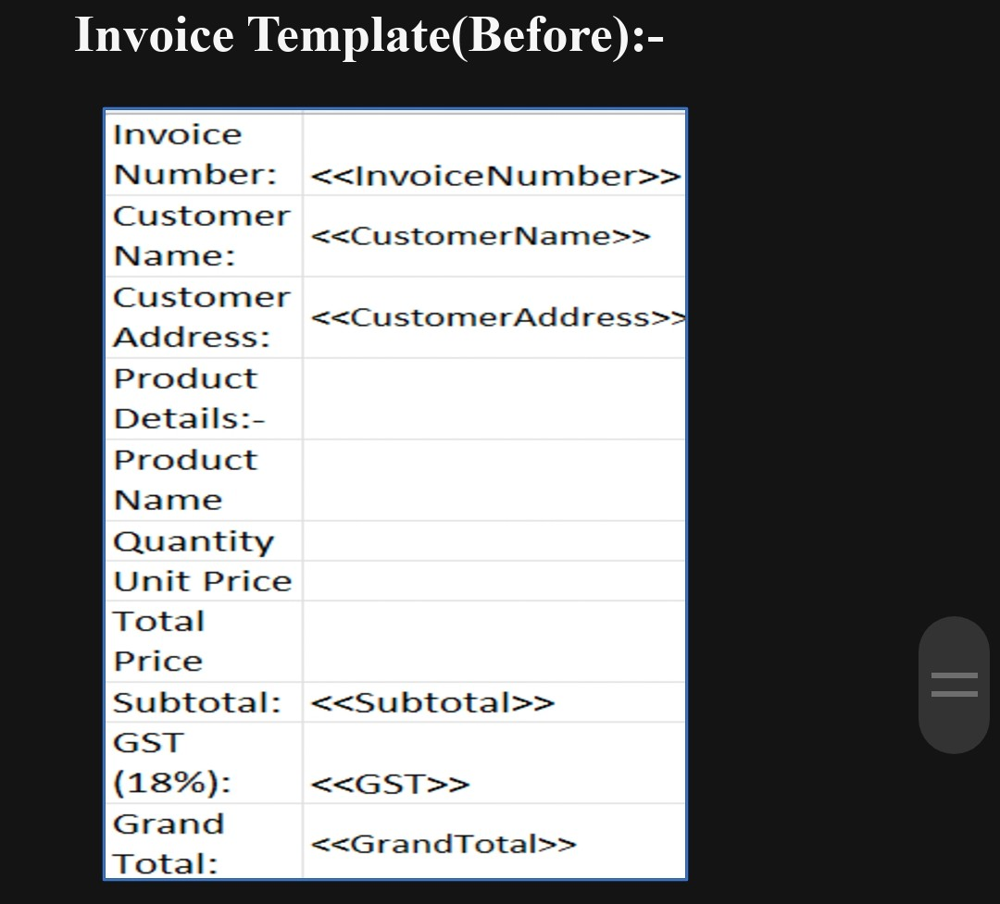
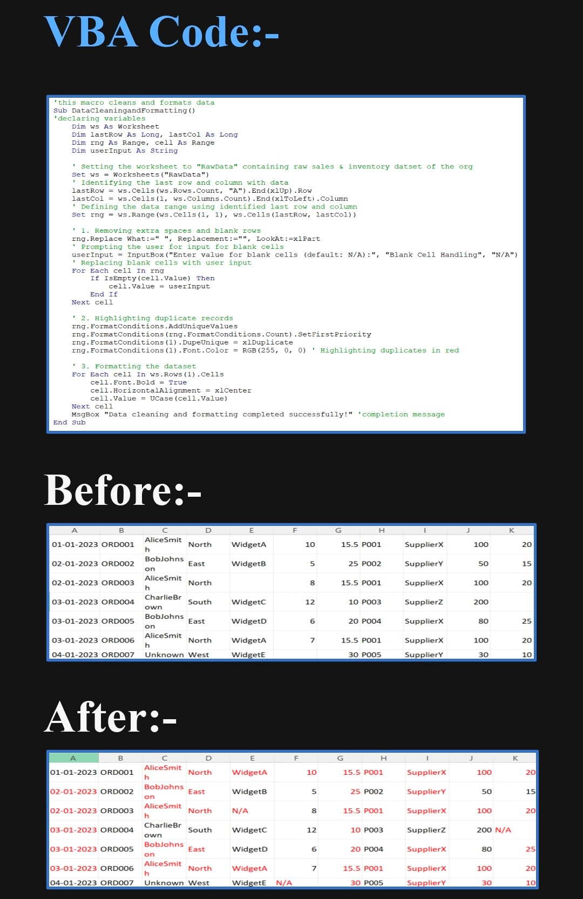
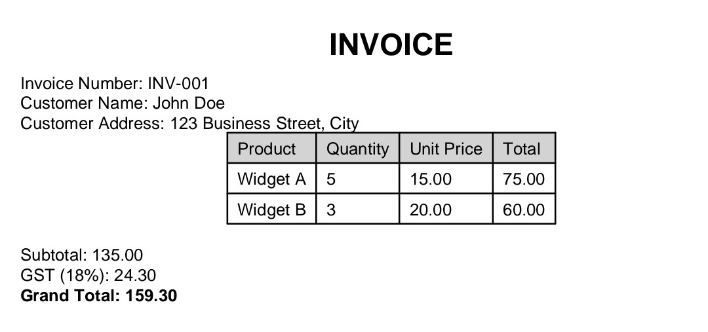

Excel VBA Process Automation Suite

A high-performance automation engine designed to eliminate manual data entry, ensure inventory integrity, and scale document generation. This project demonstrates modular programming, defensive coding, and dynamic data handling.

Key Features

* Dynamic Inventory Management: Real-time stock tracking with automated reorder alerts using search algorithms that adapt to column shifts.
  

* Intelligent Data Sanitization: Multi-step cleaning pipeline that handles whitespace, duplicates, and inconsistencies via optimized VBA arrays.
  
  
* Batch Invoice Generation: Modular engine that groups transaction data into professional PDF invoices with automated file naming and directory management.
  
  
Technical Implementation

* Defensive Programming: Implementation of robust Error Handling (`On Error GoTo`) to ensure system stability.
* Modular Architecture: Separation of concerns using dedicated subroutines for data, logic, and UI.
* Dynamic Range Detection: Use of `CurrentRegion` and `.Find` methods to ensure the code remains "bulletproof" even if the dataset structure changes.

Sample Data: Dummy sales data used for demonstrating invoice generation and reporting.
[sample-data-sales.xlsx](sample-data/sample-data-sales.xlsx)

Documentation: Detailed explanation of the project workflow, automation logic, and design decisions
[Project_Overview_Excel_VBA_Automation](docs/Project_Overview_Excel_VBA_Automation.docx)

Project Structure
/src          : Source code (.bas files) for technical review
/screenshots  : Visual proof of dashboards and generated outputs
/docs         : Project documentation (PDF)
/sample-data  : Normalized datasets used for stress-testing
README.md        → Project overview

About the Developer

I am an Engineering Student focused on the intersection of data analytics, systems thinking, and practical business automation. 

While many focus on building complex software, I specialize in high-impact efficiency: taking messy, manual workflows and transforming them into scalable, bulletproof systems using the tools businesses use every day. 

Core Competencies:
* Advanced Data Modeling: Transforming raw, inconsistent data into actionable business intelligence.
* Process Optimization: Reducing operational overhead by automating repetitive manual tasks.
* Defensive Engineering: Building resilient code that handles errors gracefully and adapts to changing data environments.

Let's connect: https://www.linkedin.com/in/shreya-auti-18a17537a

